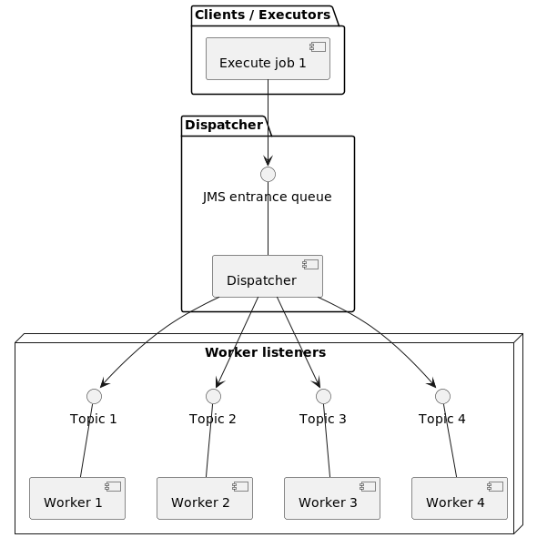

# Muxi

An example of parallelized execution with jms brokers (in a box).
A POC for calculation.

## Instructions:

run the app with [Application](src/main/java/io/endeios/muxi/api/Application.java)

The Dispatcher distributes the work given to him by the run
ot the [Test](./src/test/java/io/endeios/muxi/api/JMSSendTest.java)

## Note on documentation
I could not find a standard springy way of expressing the configs in 
the proprieties files: not a big deal but bothersome.

## Links
- https://stackoverflow.com/questions/34063230/adding-dynamic-number-of-listenersspring-jms
- https://dzone.com/articles/using-jms-in-spring-boot-1
- https://spring.io/guides/gs/messaging-jms/
- https://www.baeldung.com/configuration-properties-in-spring-boot
- https://www.baeldung.com/spring-jms
- https://www.baeldung.com/spring-boot-app-as-a-service
- https://www.baeldung.com/spring-jms-testing
- https://docs.spring.io/spring-boot/docs/current/api/org/springframework/boot/autoconfigure/jms/JmsProperties.html
- https://docs.spring.io/spring-framework/docs/3.0.x/spring-framework-reference/html/beans.html#beans-factory-lifecycle-processor
- https://www.baeldung.com/lmax-disruptor-concurrency